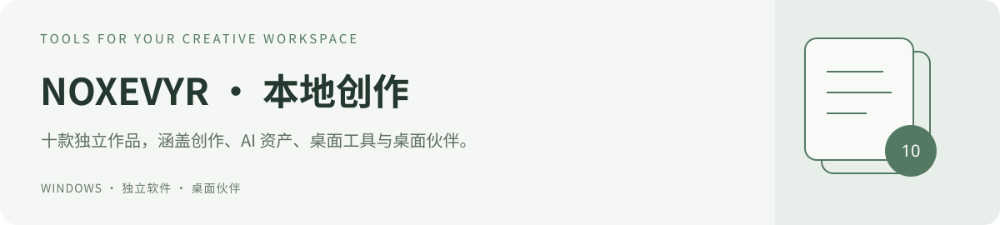
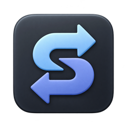
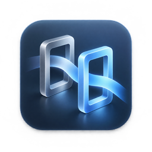
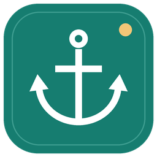

# NOXEVYR · 软件与桌面作品

选择你需要的软件，进入它自己的项目页。这里汇总 10 款作品的当前名称、图标和使用入口；[个人网站](https://noxevyr.github.io/) 提供界面预览与更完整的介绍。

## 创作与桌面工具

| 图标 | 软件 | 主要用途 | 当前入口 |
| --- | --- | --- | --- |
|  | [映序 YingXu](https://github.com/NOXEVYR/yingxu) | 按作品整理素材、文稿、角色与分镜，跟踪制作进度。 | [说明与下载](https://github.com/NOXEVYR/yingxu#readme) |
|  | [棱光 PrismCanvas（原 FrameWeave）](https://github.com/NOXEVYR/frameweave) | 在画布中编排图片与视频生成，连接本地 ComfyUI 并检查依赖。 | [说明与下载](https://github.com/NOXEVYR/frameweave#readme) |
|  | [曜核（原 AI Hub）](https://github.com/NOXEVYR/ai-hub) | 管理跨项目复用的模型、LoRA、工作流、出图库与运行记录。 | [说明与下载](https://github.com/NOXEVYR/ai-hub#readme) |
|  | [Codex Switcher](https://github.com/NOXEVYR/codex-switcher) | 切换 Codex 使用的 API 服务、接口地址和模型配置。 | [说明与下载](https://github.com/NOXEVYR/codex-switcher#readme) |
|  | [流向 FlowSwitch](https://github.com/NOXEVYR/proxy-switch) | 管理程序分流、代理入口和本地网关，查看已观察到的连接线路。 | [说明与下载](https://github.com/NOXEVYR/proxy-switch#readme) |
|  | [拾影 VideoCatch](https://github.com/NOXEVYR/video-catch) | 捕获并下载网页视频，精确裁剪本地片段，支持 AI 助手通过本机接口控制。 | [0.4.2 下载](https://github.com/NOXEVYR/video-catch/releases/tag/v0.4.2) · [使用说明](https://github.com/NOXEVYR/video-catch#readme) |
|  | [环境锚点 EnvAnchor](https://github.com/NOXEVYR/env-anchor) | 将选中的文件与软件配置复制到保留盘，核验后管理连接与撤销。 | [说明与下载](https://github.com/NOXEVYR/env-anchor#readme) |
|  | [ClassicDesk](https://github.com/NOXEVYR/classicdesk) | 编辑任务栏、资源管理器、右键菜单与皮肤方案；当前为预览版。 | [说明与下载](https://github.com/NOXEVYR/classicdesk#readme) |

**映序与曜核怎么选：** 围绕一部作品或一个创作项目整理素材、文稿和进度，选映序；整理跨项目使用的模型、LoRA、工作流和出图库，选曜核。

**名称已同步，下载以公开发行包为准：** 棱光 PrismCanvas 的原名为 FrameWeave，仓库地址仍为 `frameweave`。曜核的原名为 AI Hub，名称和金色眼形图标已更新；截至 2026-09-25，公开下载仍为 AI Hub 2.6.0，本地新版不等于已公开发布。

ClassicDesk 仍为预览版，公开包的真实系统增强范围以项目说明为准。棱光的环境检查针对本地 ComfyUI 与工作流依赖。

## 桌面伙伴

| 图标 | 软件 | 主要用途 | 当前入口 |
| --- | --- | --- | --- |
|  | [枣子姐桌宠 NatsumePet](https://github.com/NOXEVYR/codex-pet) | 四季夏目 Q 版桌宠；五套服装、部位互动、自由摆放、四档尺寸，重力可选。 | [说明与下载](https://github.com/NOXEVYR/codex-pet#readme) |
|  | [米雪儿桌宠 Michele Desktop Pet](https://github.com/NOXEVYR/michelle-pet) | 中英双语桌宠与键鼠搭子；经典制服、宿舍长发、互动表情和自由摆放。 | [说明与下载](https://github.com/NOXEVYR/michelle-pet#readme) |

## 下载与后续更新

每款软件的源码、截图、安装说明、公开下载与问题反馈都在对应独立仓库维护。上面的「说明与下载」直接进入当前项目说明，适用于 GitHub Release 和仓库内安装包两种发布方式。软件持续更新时，以该项目页为准。

旧名称、历史版本与兼容入口

`ai-hub/`、`frameweave/` 等旧目录名、迁移前源码及历史安装包继续保留。名称更新不改变这些兼容路径，也不把旧源码中的产品名批量替换成新版本。

[仓库分工、名称对应与历史入口](docs/GITHUB_PROJECTS.md)

